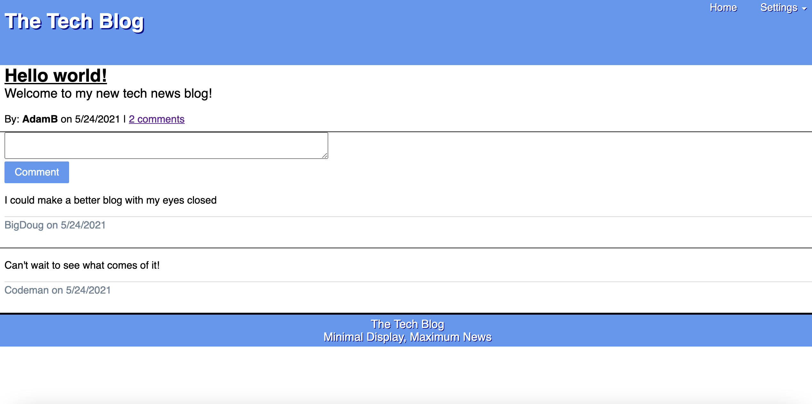
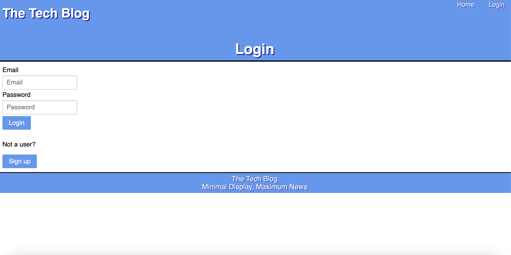
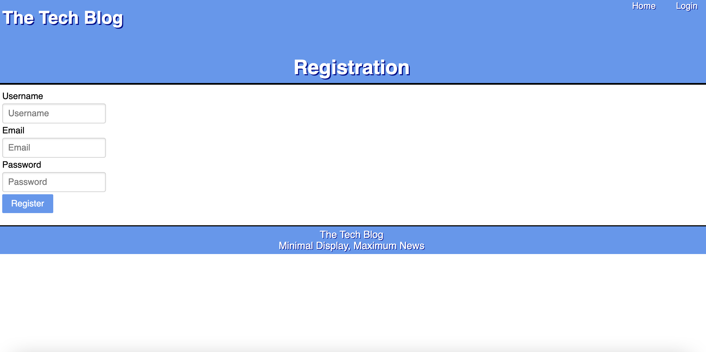
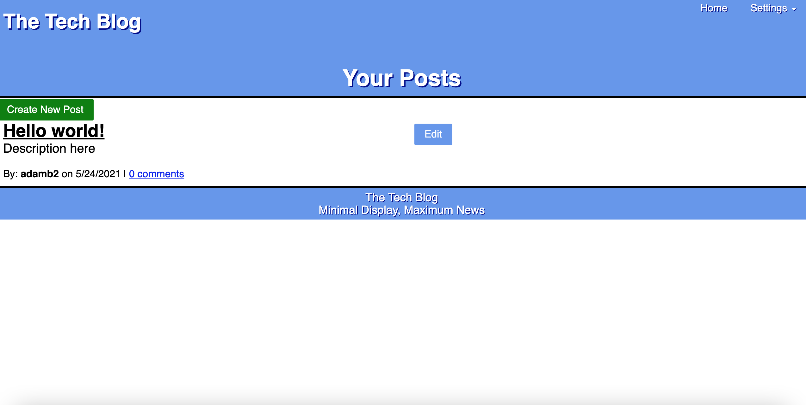
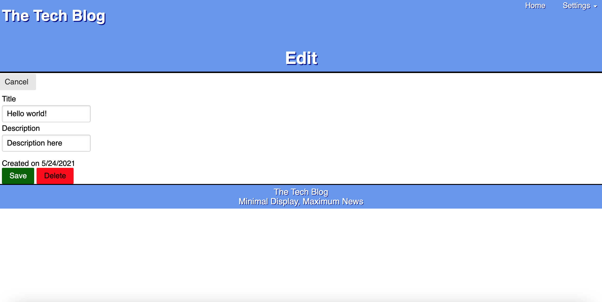
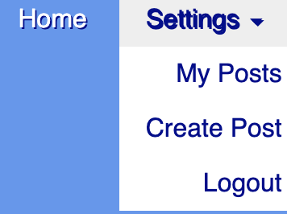

# The Tech Blog 
## Description 
The Tech blog is a blog with a minimalist approach for users to post about the latest involving tech. User can create an account using a username, email, and protected password. The site includes a homepage housing all posts with a comment link wheres users can comment on selected post. Each user is also given a user page where they can view all of their posts and either edit or delete them. 
## Deployed app
Deployed with heroku. 
https://polar-stream-25812.herokuapp.com/  
## Table of Contents 
* [Layout](#layout) 
* [User](#user) 
* [Technology](#technology) 
* [Questions](#questions) 
## Layout 
Viewing the homepage.
 

When viewing a single post, displaying comment functionality. 
 

Users who already have an account can login with their email and password. Users will be automatically logged after an hour of being away. 
 

Users who do not have an account can find a signup on the login page leading them to the registration page. 
 

## User 
Users can view their own posts on their userpage.
 

Clicking on edit will allow users to edit or delete their posts.
 

The login at the top right will change to a settings dropdown where users will have quick access to their user page, create post page, or logout.
 

## Technology 
Javascript  CSS  Pure CSS  SQL  NPM  Express(handlebars, session)  MySQL2(NPM)  Handlebars 
Bcrypt  Sequelize(connect session)  Dotenv  Heroku 

## Questions 
GitHub: https://github.com/adambedingfield 
Email: adamcbedingfield@gmail.com 
